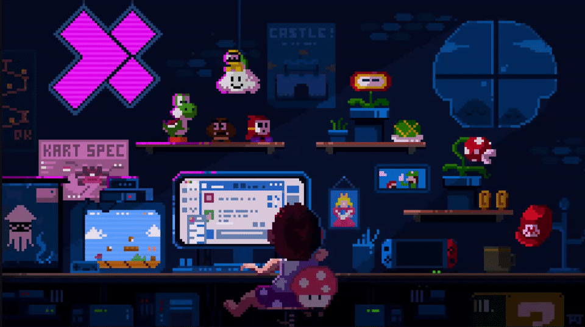

<h1 align="center">Hi, I am Sumit Roy</h1>

  

  

  
  
  
  

  

## About Me

- B.Tech student in Computer Science Engineering (Artificial Intelligence and Machine Learning)
- Building projects based on machine learning and deep learning
- Exploring agentic AI and modern AI coding tools
- Continuously learning new technologies and sharpening practical problem-solving skills
- Comfortable with tools like Codex, Cursor, Claude Code, Antigravity, and similar AI-first developer workflows

## Tech Stack

  
  
  
  
  
  

  
  
  
  
  
  
  
  

  
  
  
  
  
  

## GitHub Stats

  
  

  

  

## Contribution Snake

  <picture>
    <source media="(prefers-color-scheme: dark)" srcset="https://raw.githubusercontent.com/SumitRoy-Gh/SumitRoy-Gh/output/github-snake-dark.svg" />
    <source media="(prefers-color-scheme: light)" srcset="https://raw.githubusercontent.com/SumitRoy-Gh/SumitRoy-Gh/output/github-snake.svg" />
    
  </picture>

## Let's Connect

Feel free to reach out if you want to collaborate on machine learning, deep learning, agentic AI, or interesting builder projects. I am always up for exchanging ideas, learning something new, and building something meaningful together.

  
  
  
  

  

  

